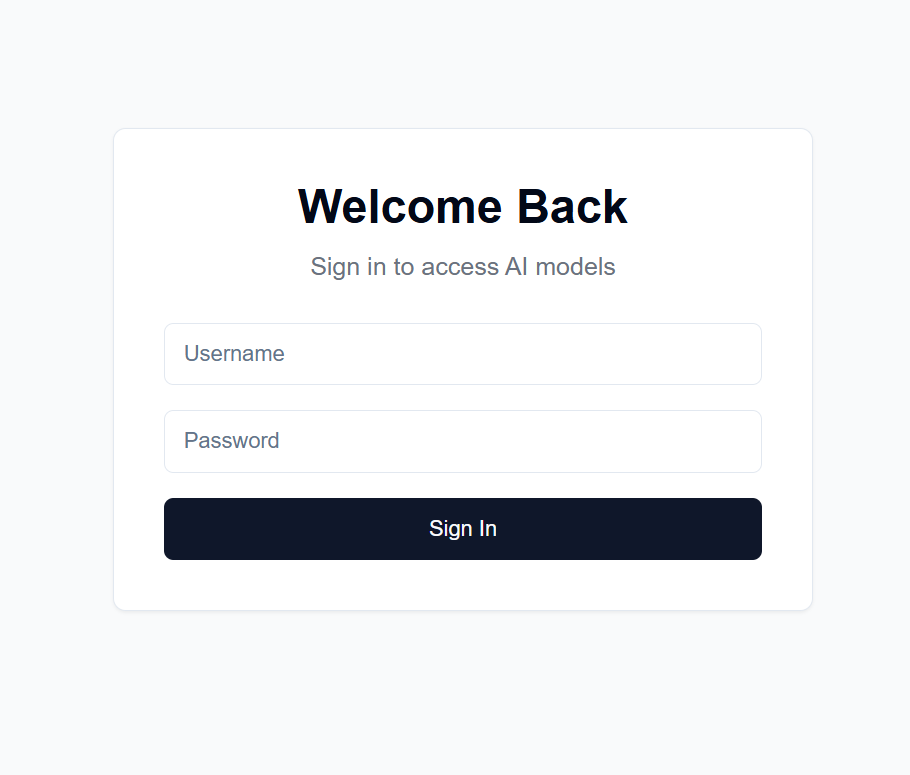

# Personal AI server
Stand up a GenAI server on your own available hardware. This project provides a web interface to interact with LLaMA and Stable Diffusion models (among others)for text, image, video, and 3D generation.

Many people have a nice GPU on hand and are willing to use that instead of pay for subscriptions from OpenAI, Anthropic, etc. Here, you can host your own AI models, albeit with many limitations as compared to those great services. Then, you can access it from anywhere with a web browser, like your phone or another computer.




## Features
- Text generation using LLaMA 3.2-1B-Instruct
- Image generation using Stable Diffusion 3.5 medium
- User authentication and JWT token-based security
- React-based frontend with modern UI components
- FastAPI backend with CORS support

## Setup

The frontend for this is hosted on GitHub Pages, while the backend is hosted on your available server machine.

After setup, the frontend will be available at `https://[username].github.io/PersonalAIserver`. Follow the instructions below to set up the backend.

### Frontend (GitHub Pages hosted)

For the frontend, only a GitHub action needs to be setup to build the project page.
In your forked repository, navigate to `Settings -> Pages -> Source`, and set it to "GitHub Actions".
The build will automatically run when you push to the repository, thanks to the `.github/workflows/main.yml` file.

### Frontend (Local hosted)

In case you want to run the frontend locally, follow the instructions below.
Requires Node.js, installable from [here](https://nodejs.org/en/download/prebuilt-installer).

1. Setup app environment
```
npm install -D @shadcn/ui
npx shadcn@latest init
npx shadcn@latest add alert button card input textarea
npm install lucide-react
npm install -D @tailwindcss/typography
npm install clsx tailwind-merge
npm install
npm install sharp
```

2. Running the local frontend
```
npm run dev
```

This should serve the frontend at `http://localhost:3000`, which you can access with a web browser.

### Backend
This uses [conda](https://docs.anaconda.com/miniconda/) for package management, but feel free to use any other package manager. 

In your terminal at the backend directory, run the following commands:
1. Create conda environment
```
conda create -n personalai python=3.11
conda activate personalai
```

2. Install dependencies
```
pip install torch torchvision torchaudio --index-url https://download.pytorch.org/whl/cu124
pip install -r requirements.txt
```

3. Hugging Face setup
- Create an account and login to [Hugging Face](https://huggingface.co/).
- Agree to the model's terms of use: [stable-diffusion-3.5-medium](https://huggingface.co/stabilityai/stable-diffusion-3.5-medium), [Llama-3.2-1B-Instruct](https://huggingface.co/meta-llama/Llama-3.2-1B-Instruct).
- Create a read-only personal access token: [settings/tokens](https://huggingface.co/settings/tokens).

4. Local files setup
- Create a `users.json` file in the backend directory with the following format:
```
{
    "username1": {
        "username": "username1",
        "password": "password1",
        "disabled": false
    },
    "username2": {
        "username": "username2",
        "password": "password2",
        "disabled": false
    }
    ...
}
```
- Create a `.secret.key` file in the backend directory with a random string of your choosing. This is used to encrypt the JWT token. I recommend generating one with:
```
import secrets
secret_key = secrets.token_hex(32)
print(secret_key)
```
and then copying the output.

5. GitHub secrets (if building for public access with GitHub Pages)
- Navigate to `Settings -> Secrets and variables -> Actions` in your forked repository
- Add a repository secret with the name `NEXT_PUBLIC_API_URL` and the value being the URL of the backend server (more details below). Example: `https://api.example.com`.

6. Running the backend
- Log in to Hugging Face with `huggingface-cli login` and use your personal access token created above as the password.
- Run the backend with `python backend/backend.py --public`, or remove `--public` if you want to run the server on localhost only. Localhost requires you run the frontend locally as well.

### Hosting the backend
Many options exist for hosting the backend at a public URL, but I recommend using Cloudflare Tunnel.
Cloudflare Tunnel routes traffic from the internet to your server without exposing a port or your local IP.
It also supports HTTPS, SSL encryption, and DDoS protection, among other security features you would otherwise need to setup and maintain yourself.

Other options include:
- Ngrok
- Local IP address + port forwarding

For Cloudflare Tunnel, you will need a domain name and Cloudflare account.

1. Install cloudflared on the backend machine: https://developers.cloudflare.com/cloudflare-one/connections/connect-apps/install-and-setup/installation/
2. Run `cloudflared tunnel login`. This step opens a browser window to log in with your Cloudflare account.
3. Run `cloudflared tunnel create genai-api`. This step generates a tunnel ID, note this for next steps.
4. Create a config file ~/.cloudflared/config.yml:
```
tunnel: <your-tunnel-id>
credentials-file: /home/user/.cloudflared/<tunnel-id>.json

ingress:
  - hostname: <your-api-url>
    service: http://localhost:8000
  - service: http_status:404
```
The `<your-api-url>` should be the domain name you have registered with Cloudflare's nameservers, and can be a subdomain. For example, if you own `example.com`, you could use `genai.example.com` or `api.example.com`.
5. Create DNS record `cloudflared tunnel route dns <tunnel-id> <your-api-url>`. This creates the tunnel for Cloudflare to route traffic from the internet to your server without exposing a port or your local IP.


## Changing models
In `backend/backend.py`, you may change the models used. Find the model on Hugging Face you'd like to use for text/image generation, and adjust the `ModelManager` model configs (line ~127). By default, this uses the LLaMA 3.2-1B-Instruct model for text generation and the Stable Diffusion 3.5 medium model for image generation.
Below are the VRAM requirements for each model tested with.

| Model Type | Model Name | VRAM Usage (GB) | Notes |
|------------|------------|-----------------|--------|
| Text | meta-llama/Llama-3.2-1B-Instruct | ~8 | Base model for text generation |
| Image | stabilityai/stable-diffusion-3.5-medium | ~13 | Works well on RTX 4090 |
| Image | stabilityai/stable-diffusion-3.5-large | ~20-30 | Exceeds 4090 VRAM for long prompts |

Note: VRAM usage may vary depending on image resolution, length of text prompts, and other parameters. Values shown are approximate for default settings. 
Quantized transformer models are supported to further reduce VRAM usage, but are not used by default (see `backend/backend.py` lines 178-192).
The large stable diffusion model can barely fit in my 4090's VRAM with quantization.
Chatbot speeds are extremely quick on my 4090, with image generation taking up to 30sec for 100 steps for 1024x1024 images.

The system prompt for the language model can be found in `backend/system_prompt.txt`.
At the moment, it is a spin on Anthropic's Claude 3.5 Sonnet model, released on October 22, 2024. https://docs.anthropic.com/en/release-notes/system-prompts#claude-3-5-sonnet

## Notes and disclaimers
- I am not a web developer or security expert, so there are likely many security and usability issues with this project. Use at your own risk. The entire frontend and login system was generated with Claude.
- This project is not affiliated with Meta or Stability AI, nor any company I work for. This is simply a personal project to learn about Hugging Face models and their deployment on local hardware.
- I do not plan on maintaining this project. It is purely a hobby project for me to learn about LLMs and AI. Feel free to contribute yourself, I'd be happy to see some pull requests!
